---

# Lab 3: Wazuh Setup Team 09

## Team Members
- Bristie, Mahin, Rabie

---

## Updated Network Diagram w/ Wazuh and Windows Workstation

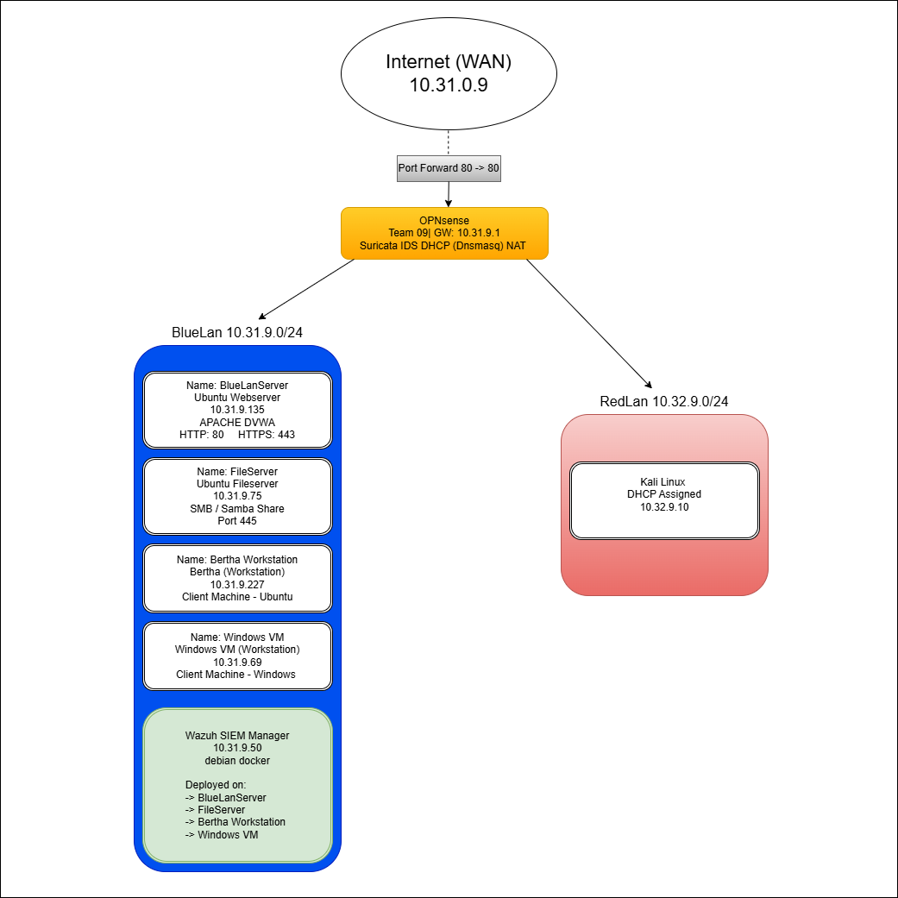

## IP Addresses

| Host | IP | Role |
|------|----|------|
| Wazuh Manager | 10.31.9.50 | SIEM Manager (debian-docker) |
| BlueLanServerGUI (Web Server) | 10.31.9.135 | Wazuh Agent 001 |
| FileServer | 10.31.9.75 | Wazuh Agent 002 |
| Workstation (Bertha) | 10.31.9.227 | Wazuh Agent 003 |
| Windows 11 VM | 10.31.9.69 | Wazuh Agent 004 |
| OPNsense Gateway | 10.31.9.1 | Router / Firewall |
| Kali | 10.31.9.10 | attack box (test brute force) |

---

## Steps Taken

### 1. Deploy Wazuh Manager

- Cloned the `debian-docker-13-wazuh` template in Proxmox
- Attached VM to `ba09000` (Blue LAN) bridge
- Booted VM and confirmed it received a DHCP address on `10.31.9.0/24`
- Set static IP `10.31.9.50/24` via Proxmox Cloud-Init with gateway `10.31.9.1`
- Regenerated Cloud-Init image and rebooted, confirmed static IP with `ip a`
- SSH'd into Wazuh VM and navigated to `~/wazuh-docker/single-node/`
- Generated indexer certificates:
  ```bash
  docker compose -f generate-indexer-certs.yml run --rm generator
  ```
- Started the Wazuh stack:
  ```bash
  docker compose up -d
  ```
- Verified all 3 containers running (`wazuh.manager`, `wazuh.indexer`, `wazuh.dashboard`):
  ```bash
  docker compose ps
  ```

 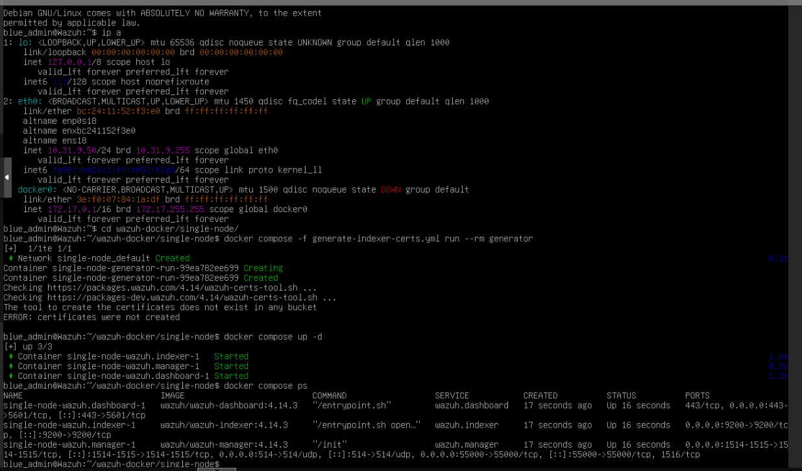


- Accessed dashboard at `https://10.31.9.50` (credentials: `admin` / `SecretPassword`)

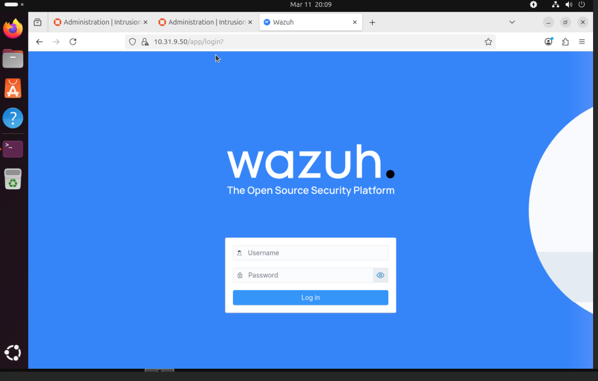
---

### 2. Deploy Linux Agents

For each agent VM (web server, file server, workstation):

- Opened browser on each VM and navigated to `https://10.31.9.50`
- Went to **Agents Management → Summary → Deploy New Agent**
- Selected: OS = Linux DEB amd64, Manager IP = `10.31.9.50`, named each agent accordingly
- Ran the generated install command on each VM:
  ```bash
  wget https://packages.wazuh.com/4.x/apt/pool/main/w/wazuh-agent/wazuh-agent_4.14.3-1_amd64.deb \
    && sudo WAZUH_MANAGER='10.31.9.50' WAZUH_AGENT_NAME='<agent-name>' dpkg -i ./wazuh-agent_4.14.3-1_amd64.deb
  ```
- Started each agent:
  ```bash
  sudo systemctl daemon-reload
  sudo systemctl enable wazuh-agent
  sudo systemctl start wazuh-agent
  ```
- Confirmed `active (running)` status with `sudo systemctl status wazuh-agent`
- All 3 agents confirmed **Active** in the Wazuh dashboard


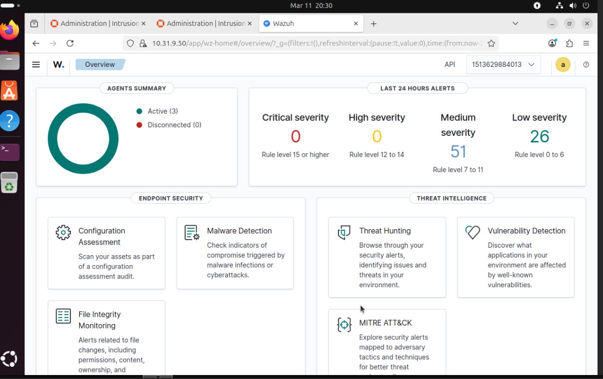

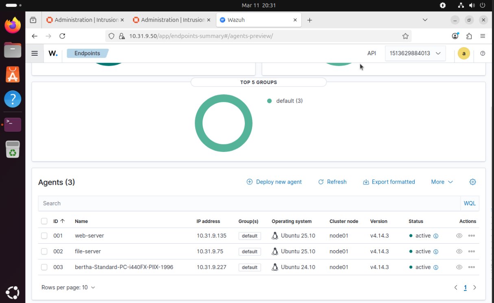
---

### 3. SSH Brute Force Detection

- From **Kali** (10.32.9.10) on Red LAN, ran 15 failed SSH attempts against the webserver:
  ```bash
  for i in {1..15}; do ssh fakeuser@10.31.9.135; done
  ```
- Entered wrong passwords for each attempt
- Waited around 30 seconds and checked Wazuh then went to Threat Hunting on web server agent
- Confirmed **level 10 alert** below: 


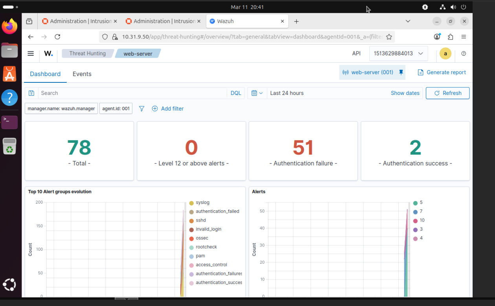

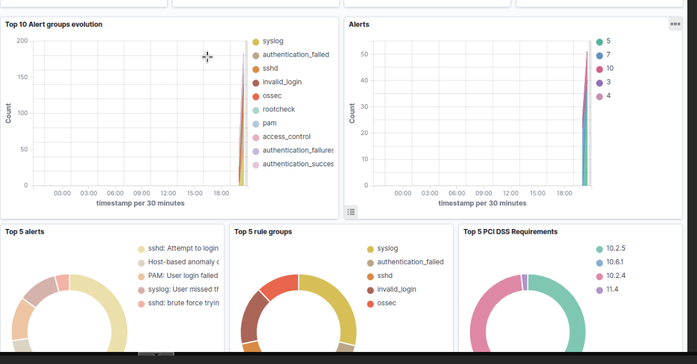

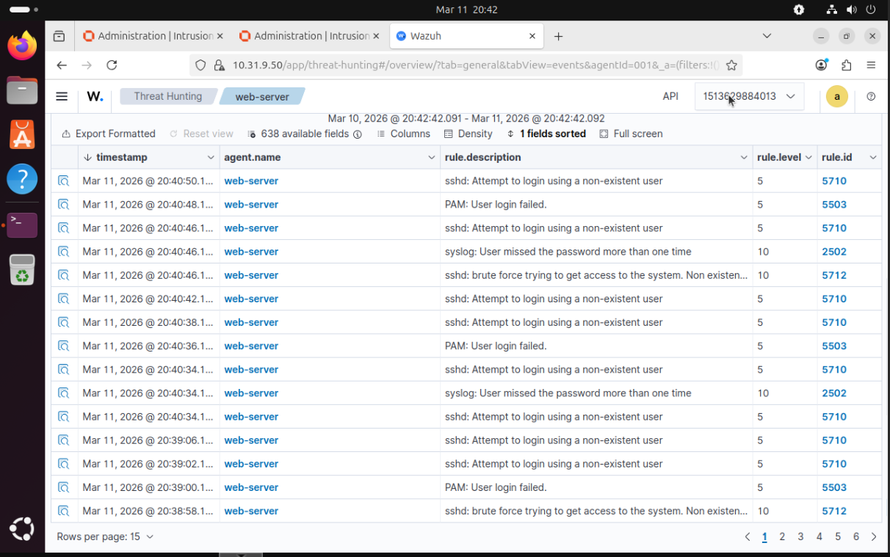


---

### 4. File Integrity Monitoring (FIM) Detection

- On **BlueLanServer**, enabled realtime FIM monitoring for `/etc` by editing `/var/ossec/etc/ossec.conf`:
  ```xml
  <directories check_all="yes" report_changes="yes" realtime="yes">/etc</directories>
  ```
- Also reduced syscheck frequency to 60 seconds for testing:
  ```xml
  <frequency>60</frequency>
  ```
- Restarted agent: `sudo systemctl restart wazuh-agent`
- Modified `/etc/passwd` to trigger a checksum change:
  ```bash
  sudo sed -i '$ a # wazuh-fim-test2' /etc/passwd
  ```
- Confirmed **level 7 alert** in Wazuh → File Integrity Monitoring → Events:
  - Rule: `Integrity checksum changed`
  - File: `/etc/passwd`
  - Event: `modified`
- Reverted the change:
  ```bash
  sudo sed -i '/# wazuh-fim-test/d' /etc/passwd
  sudo sed -i '/# wazuh-fim-test2/d' /etc/passwd
  ```
Proof on concept below:


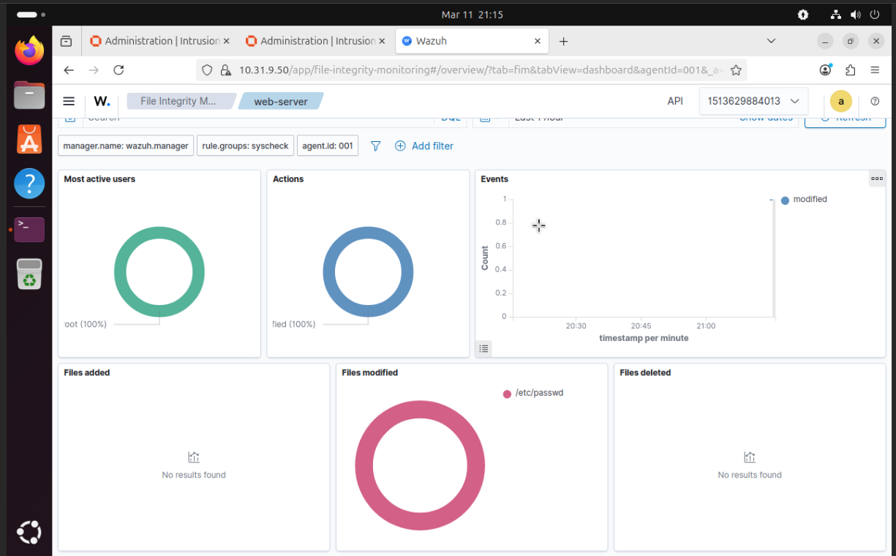

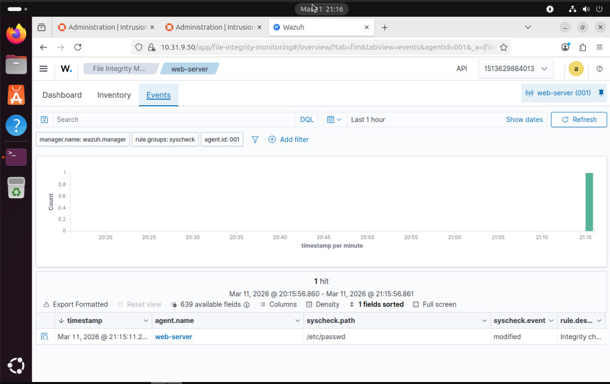

---

### 5. Bonus: Windows VM Deployment

To earn the bonus points for this lab, we successfully deployed a Windows 11 VM within the Proxmox environment, configured its networking for the Blue LAN, and enrolled it as an active agent in the Wazuh SIEM.

---

#### 5.1 VM Provisioning & OS Installation

- Created a new VM in Proxmox using the Windows 11 ISO
- Added a **TPM 2.0** device and set BIOS to **OVMF (UEFI)** to meet Windows 11 hardware requirements
- During installation, used `Shift + F10` to open a terminal and ran `OOBE\BYPASSNRO` to skip the mandatory sign in with internet requirement and create a local user account
- Mounted `virtio-win.iso` and loaded **VirtIO SCSI drivers** during setup so the installer could detect the virtual hard disk and be able to connect to internet.

---

#### 5.2 Network Configuration (Blue LAN)

Since the Windows VM lacks native VirtIO networking drivers out of the box, additional steps were required to establish connectivity on the `10.31.9.0/24` subnet:

- **Static IP Assignment:** Configured the interface via PowerShell:

  ```powershell
  # Set Static IP and Gateway
  New-NetIPAddress -InterfaceAlias "Ethernet" -IPAddress 10.31.9.69 -PrefixLength 24 -DefaultGateway 10.31.9.1

  # Set DNS
  Set-DnsClientServerAddress -InterfaceAlias "Ethernet" -ServerAddresses ("8.8.8.8","1.1.1.1")
  ```

We simply had to make our Windows User Codi West C:


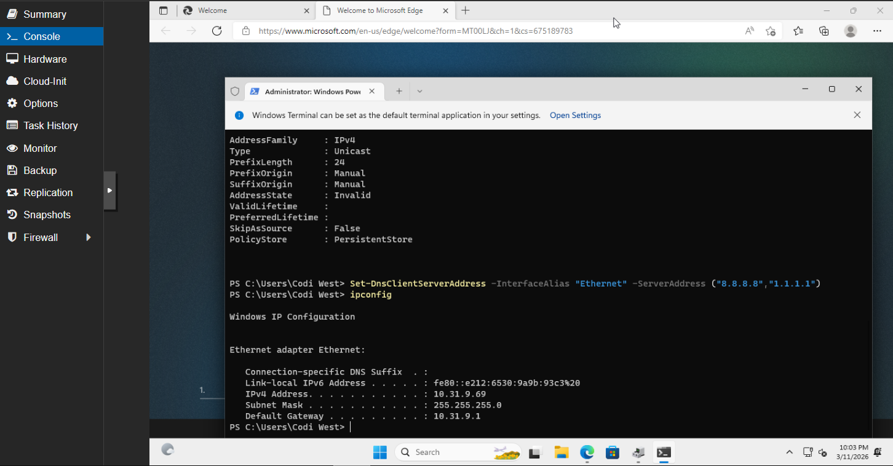

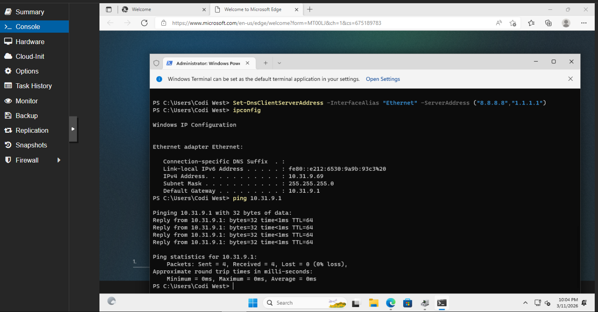

---

#### 5.3 Wazuh Agent Deployment

- **Connectivity Check:** Verified HTTPS access to the Wazuh Manager at `https://10.31.9.50` 
- **Installation:** Generated a Windows deployment command via the Wazuh Dashboard **Deploy New Agent** wizard (OS = Windows, Manager IP = `10.31.9.50`) and executed it in PowerShell as Administrator
- **Service Activation:** Started the Wazuh agent service to initiate the handshake with the manager:

  ```powershell
  Start-Service -Name "Wazuh"
  ```

- Confirmed the agent appeared as **Active** in the Wazuh dashboard

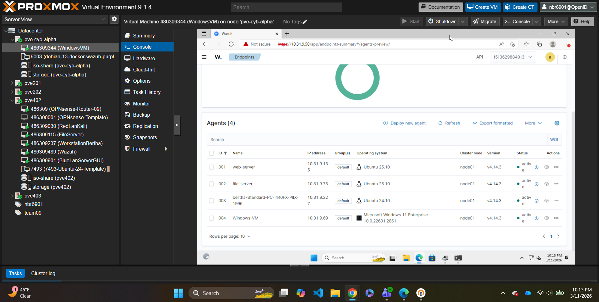


