# Lab 6 – Network Integration & Pre-Engagement Readiness

**Team:** Group 9  
**Course:** CYB-4863 Purple Teaming  
**Due:** April 26, 2026

---
## Updated Network Diagram + New Hosts

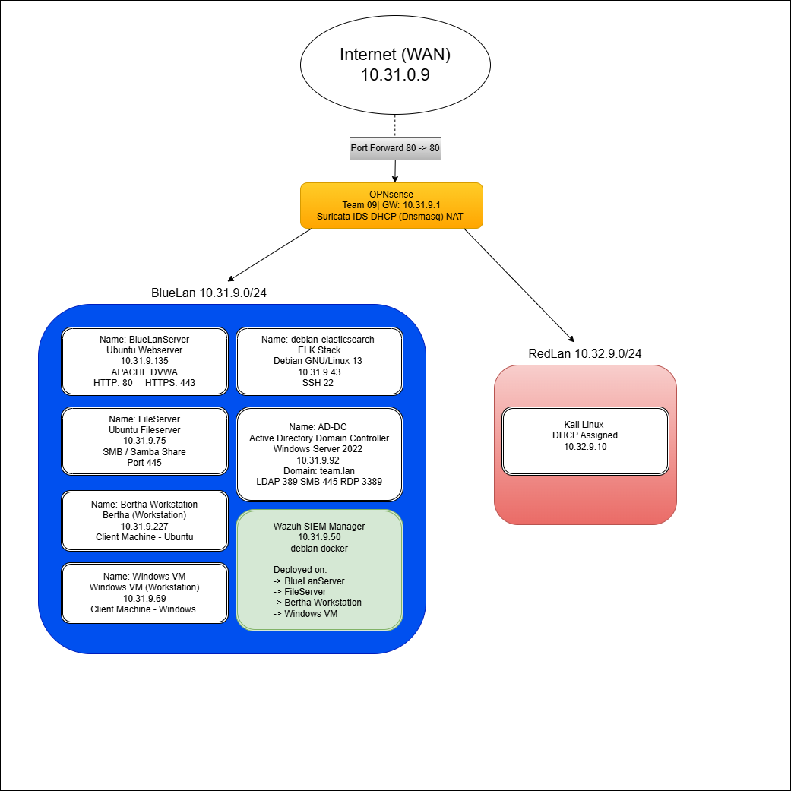 


## Overview

This lab simulates a real-world scenario in which previously disconnected infrastructure was reconnected to an existing network without prior documentation. As the blue team for Wingdings Incorporated, our task was to discover the new hosts, integrate them into our centralized monitoring platform, update all network documentation, and prepare for an upcoming red team engagement.

## Host Discovery

Two previously disconnected hosts were identified on the LAN using a combination of DHCP lease analysis in OPNsense and active Nmap scanning.

**Initial discovery via DHCP leases (OPNsense → Services → DHCPv4 → Leases)** revealed two unfamiliar hostnames alongside known hosts.

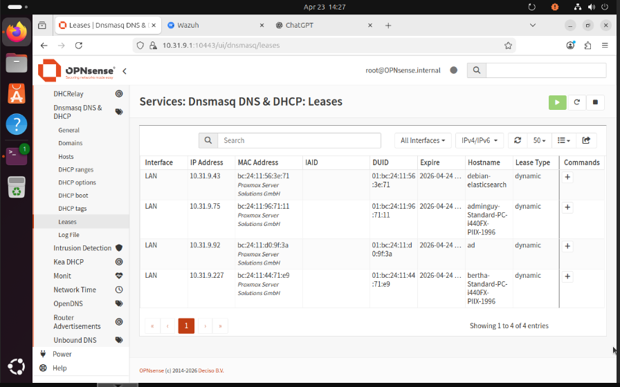 


**ICMP-based scanning (`nmap -sn 10.31.9.0/24`) did not detect the new hosts**, despite their presence in DHCP. This indicated ICMP filtering — a common hardening posture on Windows servers and some Linux deployments.

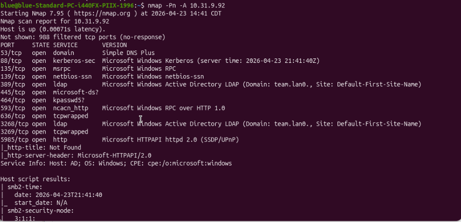 

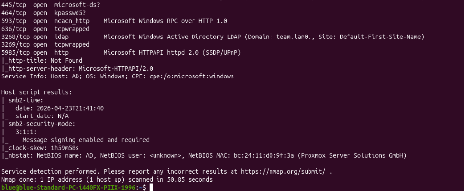 

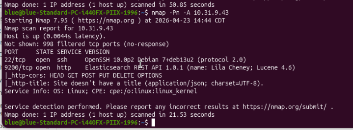 

### Discovered Hosts

| Hostname               | IP Address   | OS             | Role                               |
|------------------------|--------------|----------------|------------------------------------|
| debian-elasticsearch   | 10.31.9.43   | Debian Linux   | ELK Stack (Logging Server)         |
| ad                     | 10.31.9.92   | Windows Server 2022 | Active Directory Domain Controller |

### Service Fingerprinting

**debian-elasticsearch (10.31.9.43)**
```
22/tcp   open  ssh     OpenSSH 10.0p2 Debian 7+deb13u2
9200/tcp open  http    Elasticsearch REST API 1.0.1 (name: Lila Cheney; Lucene 4.6)
OS: Linux (Debian)
```

**ad (10.31.9.92)**
```
53/tcp   open  domain       Simple DNS Plus
88/tcp   open  kerberos-sec Microsoft Windows Kerberos
135/tcp  open  msrpc        Microsoft Windows RPC
389/tcp  open  ldap         Active Directory LDAP (Domain: team.lan)
445/tcp  open  microsoft-ds SMB (signing: required)
3268/tcp open  ldap         Active Directory LDAP (Global Catalog)
3389/tcp open  ms-wbt-server RDP
OS: Windows Server 2022; Domain: TEAM
```

## Wazuh Agent Deployment 

### debian-elasticsearch (Linux)

Access obtained via SSH using credentials discovered through lab environment enumeration:

```bash
ssh root@10.31.9.43
# password: password
```

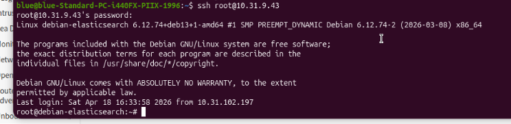 

The Wazuh agent was deployed using the dashboard's Deploy New Agent wizard (Agents Management → Summary → Deploy new agent), selecting Linux → DEB amd64, server address `10.31.9.50`, agent name `debian-elasticsearch`. The generated commands were run on the ELK box:

```bash
curl -sO https://packages.wazuh.com/4.x/wazuh-agent.sh
sudo bash wazuh-agent.sh -a 10.31.9.50
sudo systemctl enable wazuh-agent
sudo systemctl start wazuh-agent
```

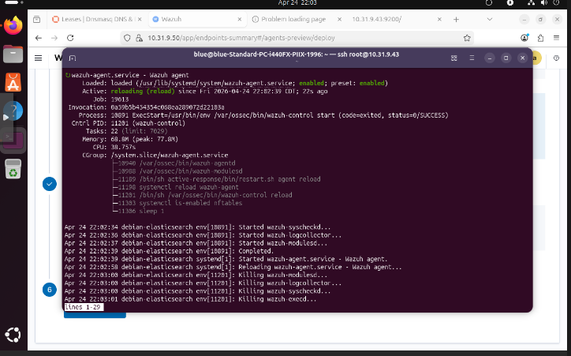 

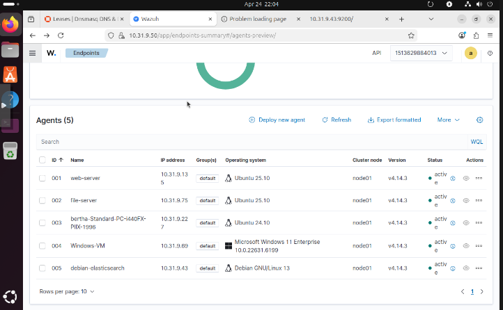 

### ad – Active Directory Domain Controller 

Access was initially attempted via Remmina RDP client on BlueLanServer and Kali. Extensive credential enumeration and brute force attempts were conducted (documented in the Troubleshooting section). Credentials were ultimately confirmed by the instructor: `Administrator` / `password123!`

RDP access established via Remmina:
- Server: `10.31.9.92`
- Username: `Administrator`
- Password: `password123!`
- Domain: (blank)

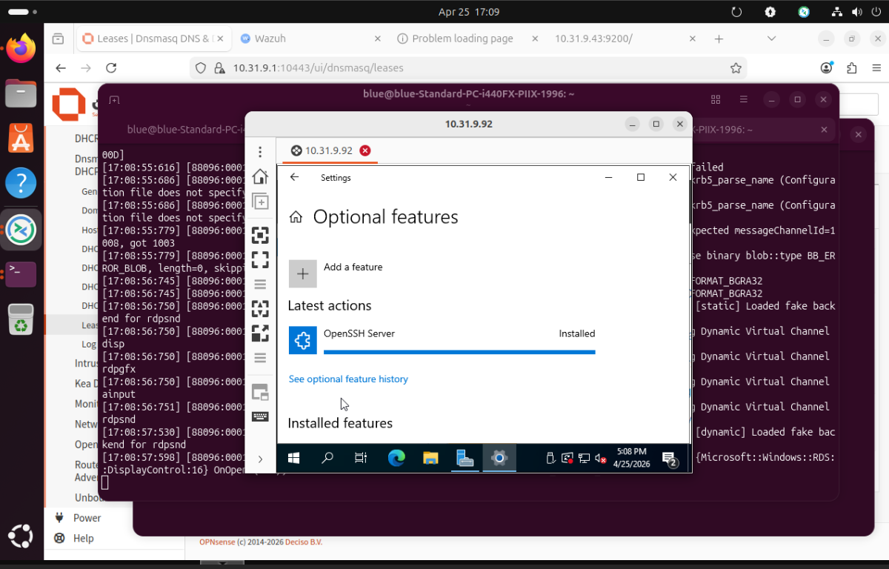 

The Wazuh agent was deployed using the dashboard's Deploy New Agent wizard, selecting Windows → MSI 32/64 bits, server address `10.31.9.50`, agent name `AD-DC`. The generated PowerShell command was run as Administrator:

```powershell
Invoke-WebRequest -Uri https://packages.wazuh.com/4.x/windows/wazuh-agent-4.x.x.msi -OutFile wazuh-agent.msi
Start-Process msiexec.exe -ArgumentList '/i wazuh-agent.msi /q WAZUH_MANAGER="10.31.9.50" WAZUH_AGENT_NAME="AD-DC"' -Wait
NET START WazuhSvc
```

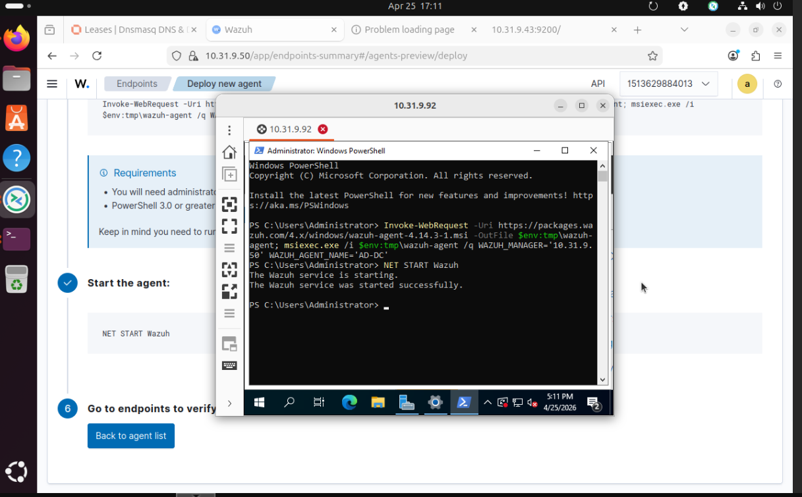 

### All Agents Active

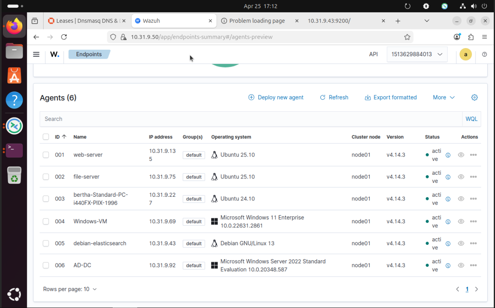 

---

## Pre-Engagement Readiness 

Our team prepared for the upcoming red team engagement through a combination of infrastructure integration, active reconnaissance, and security assessment of newly discovered systems.

**Host Discovery & Reconnaissance**  
We began with DHCP lease analysis in OPNsense, which surfaced two unfamiliar hostnames. Initial ICMP-based Nmap scans (`-sn`) failed to detect these hosts — a sign of ICMP filtering rather than hosts being offline. We adapted by using `-Pn` flag scans, bypassing host discovery and returning full service fingerprints for both systems. This process reinforced a key operational lesson: DHCP visibility and ping reachability are not equivalent. We also ran targeted enumeration scripts (`ldap-search`, `smb-enum-users`, `msrpc-enum`) to gather as much intelligence as possible about the AD domain.

**Credential Discovery & Access**  
For the ELK stack, credentials were discovered through enumeration of the lab environment (`root` / `password`). For the AD-DC, we conducted an extensive multi-tool credential attack including custom wordlists, Hydra brute force over RDP and SMB, crackmapexec, enum4linux, and Metasploit modules (ms17_010_eternalblue, psexec, smb_login). Key findings from this process included: SMB signing enforcement blocking SMB-based attacks, the Administrator account being restricted from RDP login, the guest account being disabled, and LDAP anonymous bind being disabled. These hardening measures significantly limited our attack surface and are documented in the Troubleshooting section.

**Security Misconfiguration Finding**  
During enumeration, we discovered the Elasticsearch REST API on port 9200 was accessible without authentication. This represents a significant internal risk as any LAN host could read or manipulate log data. This finding was documented and remediation recommended.

**Monitoring Integration**  
We deployed Wazuh agents on both new hosts and verified active log ingestion in the dashboard. With all hosts now reporting to the SIEM, we have full visibility across the network. The addition of the Active Directory domain controller is particularly valuable — Kerberos-related attacks commonly used by red teams (pass-the-hash, Kerberoasting, ticket forgery, lateral movement) will now generate detectable events in Wazuh.

**Infrastructure Review**  
We reviewed OPNsense firewall rules, confirmed Suricata IDS is active, and verified all existing agents remained active throughout the lab. Network segmentation between BlueLan and RedLan was confirmed to be in place.

---

## Troubleshooting & Technical Findings

### AD-DC Access – Extensive Attempt Log

Despite confirmed network connectivity and open ports, obtaining RDP access to the AD-DC server required extensive enumeration. Below is the full log of what was attempted and what was learned.

#### Confirmed network access
- Ping from Kali (10.32.9.10) → AD-DC (10.31.9.92): successful, 0% packet loss
- Port 3389 (RDP) confirmed open via `nmap -Pn`
- Port 445 (SMB) confirmed open
- OS confirmed: Windows Server 2022, Domain: `team.lan`

#### RDP attempts via Remmina
Tried `Administrator` with: `password`, `Password1`, `Password123`, `P@ssword`, `P@ssw0rd`, `Admin123`, `Welcome1`, `Wingdings1!`, `Cyber2025!`, `Student1!`, `Purple123!` — all failed. Kerberos errors in background (`STATE_RUN_FAILED`, `cannot find KDC`) indicated Remmina config issues on BlueLanServer independent of password correctness.

#### Tool installation failures
- `freerdp2-x11`, `freerdp3-x11`: unable to locate package on Ubuntu VMs
- `crowbar`: unable to locate package
- `kerbrute`: not found, install failed
- `rockyou.txt` download: blocked by network egress restrictions on Bertha

#### Hydra brute force
```bash
hydra -l Administrator -P ~/adpasswords.txt rdp://10.31.9.92 -t 4   # 0 valid passwords
hydra -l Administrator -P ~/adpasswords.txt smb://10.31.9.92 -t 4   # invalid reply (SMB signing)
```

#### enum4linux findings (from Kali)
- Domain Name: `TEAM`
- Domain SID: `S-1-5-21-586311673-3883600126-263553560`
- Known usernames: `administrator, guest, krbtgt, domain admins`
- Guest account: **DISABLED**
- SMB signing: **enforced** — blocked hydra SMB module

#### crackmapexec findings (from Kali)
```bash
crackmapexec smb 10.31.9.92 -u administrator -p ~/adpasswords.txt
# STATUS_LOGON_FAILURE for all passwords

crackmapexec smb 10.31.9.92 -u guest -p ''
# STATUS_ACCOUNT_DISABLED
```

#### Critical finding – Administrator RDP restriction
Hydra RDP output revealed:
```
account on 10.31.9.92 might be valid but account not active for remote desktop
```
The Administrator account exists but was not permitted to RDP, a common Windows Server hardening measure. This meant even the correct password would not grant RDP access through that account via brute force testing.

#### Metasploit attempts (from Kali)
```
use exploit/windows/smb/ms17_010_eternalblue  → not vulnerable (patched, Server 2022)
use exploit/windows/smb/psexec               → STATUS_LOGON_FAILURE (wrong password)
use auxiliary/scanner/smb/smb_login          → blocked by SMB signing
```

#### Resolution
Credentials confirmed by instructor: `Administrator` / `password123!`  
RDP access successfully established via Remmina after credential confirmation. Wazuh agent deployed and verified active.

#### Blocker summary

| Blocker | Impact |
|---|---|
| SMB signing enforced | Blocked Hydra and crackmapexec SMB brute force |
| Administrator RDP restricted | RDP brute force returned no valid login |
| LDAP anonymous bind disabled | Could not enumerate users via LDAP |
| Guest account disabled | Null session enumeration blocked |
| EternalBlue patched | Metasploit SMB exploit not applicable |
| Network egress restrictions | Could not download wordlists or tools on some VMs |

---

Sources:
- Utilized Gemini for troubleshooting.
