# lab-network-documentation

**Team 09** | February 2026

## Overview
This repository contains the infrastructure configuration and documentation for a segmented lab environment. The network consists of a Blue LAN, Red LAN, and a WAN interface, all routed through an OPNsense router.


---

## Network Topology Diagram

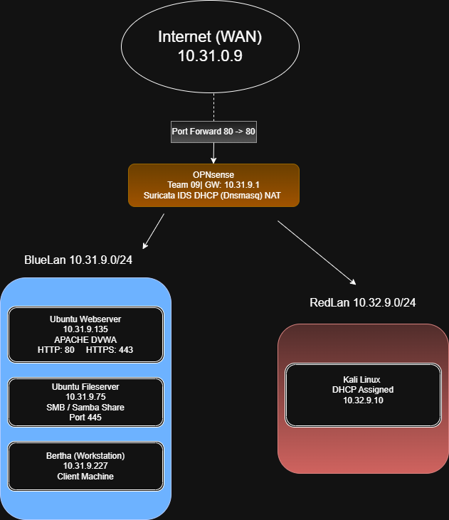

---

## Phase 1: Infrastructure Deployment & Initial Debugging

### 1.1 VM Provisioning

We utilized a hybrid approach to build the lab environment:

- First, we created `BlueLanServerGUI` (webserver), `FileServer` (fileserver), and `WorkstationBertha` (workstation) from the instructions provided in class.
- Then built a Kali Linux VM `RedLanKali` (attack box) using the same notes as earlier.

---

## Deploy Core Infrastructure

The following steps outline how we got the web server deployed and accessible from WAN.

### Step 1: Apache Installation & Static IP Configuration

After creating and booting `BlueLanServerGUI`, we first fixed the Ubuntu package repositories (see Appendix A), then installed Apache:

```bash
sudo apt update
sudo apt install apache2 -y
sudo systemctl enable apache2
sudo systemctl start apache2
```

To confirm Apache was running locally before exposing it externally:

```bash
sudo systemctl status apache2
curl http://localhost
```
The following
**Static IP Configuration** was set on `BlueLanServerGUI` by editing the Netplan config:

```bash
sudo nano /etc/netplan/00-installer-config.yaml
```

```yaml
network:
  version: 2
  ethernets:
    ens18:
      addresses:
        - 10.31.9.135/24
      routes:
        - to: default
          via: 10.31.9.1
      nameservers:
        addresses: [8.8.8.8, 1.1.1.1]
```

```bash
sudo netplan apply
```

This locked `BlueLanServerGUI` to `10.31.9.135` so the NAT forwarding rule would have a reliable destination.

## DVWA Deployment

After Apache was confirmed operational, DVWA was deployed on BlueLanServerGUI using Docker.

Docker Installation
```
sudo apt update
sudo apt install docker.io -y
sudo systemctl enable docker
sudo systemctl start docker
```

Docker status was verified:
```
sudo systemctl status docker
```
## DVWA Container Deployment

DVWA was deployed with port mapping configured for internal access:
```
sudo docker run -d -p 8080:80 vulnerables/web-dvwa
```
## Verification

Container status was verified:
```
sudo docker ps
```
Listening port confirmed:
```
ss -tulnp | grep 8080
```
Internal access was tested from Blue Workstation:

http://10.31.9.135:8080

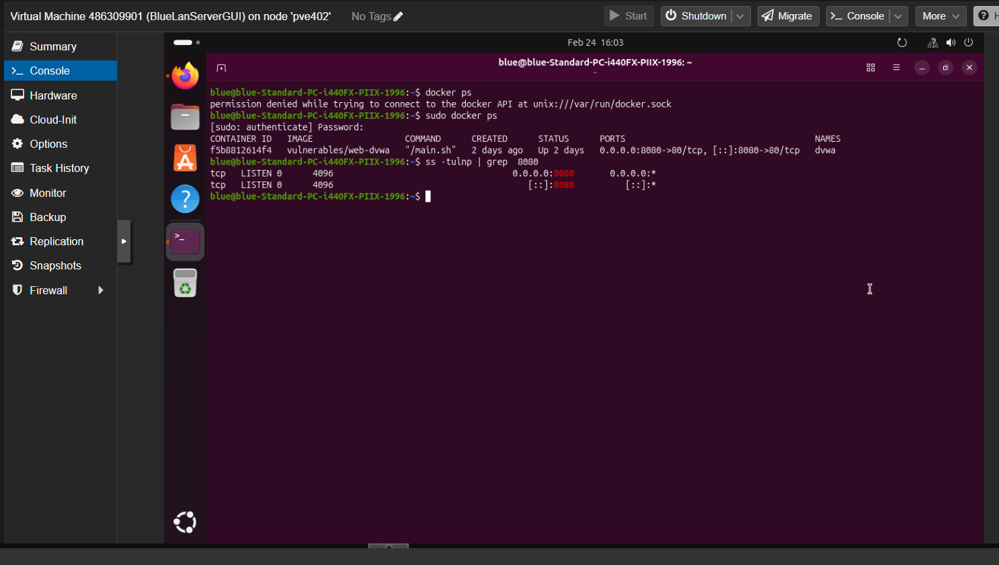
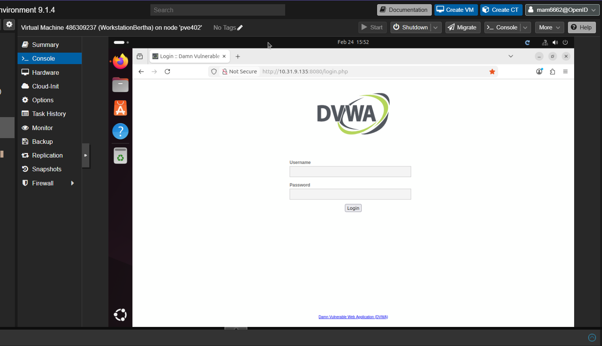
---

### Step 2: OPNsense WebGUI Port Change & Port Forwarding Setup

**Note:** We ran into another issue where external requests to WAN (`10.31.0.9`) on Port 80 were hitting the OPNsense login page instead of the web server. And so, we discovered the solution was to free up Port 80 by:

1. Navigating to **System -> Settings -> Administration**
2. Changed the OPNsense WebGUI port from `80` to `10443`
3. Set Protocol to **HTTPS only** and saved, allowing NAT usage and freeing Port 80.

**Creating the NAT Port Forward Rule:**

1. Navigated to **Firewall -> NAT -> Source Destination -> Add**
2. Configured the rule as follows:

| Field | Value |
| --- | --- |
| Interface | WAN |
| Protocol | TCP |
| Destination | WAN address |
| Destination Port | 80 |
| Redirect Target IP | 10.31.9.135 |
| Redirect Target Port | 80 |

3. Lastly, we saved and applied forcing OPNsense to automatically generated the associated WAN firewall pass rule.

Accomplished and verified the addition of **Firewall rule: Allow WAN -> web-server:80** as shown below:

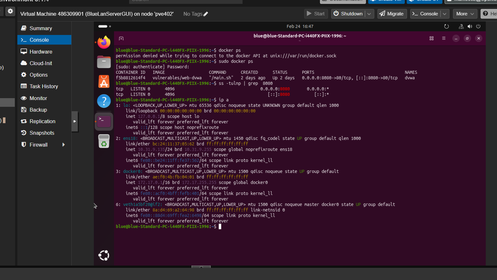

Lastly, as per the webserver OPNsense requirements, we validated the ability to **prevent SSH from WAN (allow blue-net -> webserver:22 SSH from internal only)** below:

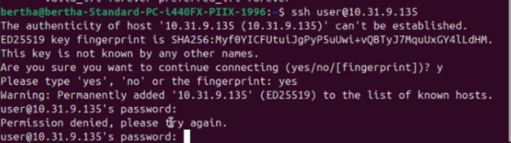

---

### External Web Access Validation

Once **Step 1** and **Step 2** were complete, we confirmed the web server's Apache default page is accessible from an external device (aka my personal laptop.)

**Accessing the Apache Welcome Page:**

1. From my personal laptop outside of the VMs in ProxMox, I oopened a browser and navigated to `http://10.31.0.9` (WAN IP of the OPNsense gateway.)
2. OPNsense matched the NAT rule and forwarded the request internally to `10.31.9.135:80`.
3. The **Apache2 Ubuntu Default Page** loaded in the browser successfully below:

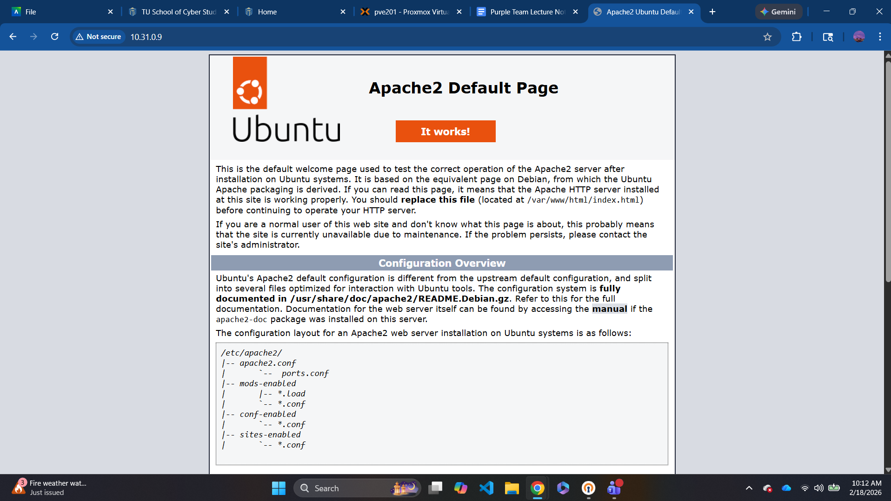

---

## Phase 2: IDS and Internal Services

This section shows step by step how we made suricata alerting operational, and the file server accessible from workstation.

### Step 1: Enable Suricata & Download ET Emerging Open Rulesets

Suricata was configured on OPNsense via **Services -> Intrusion Detection**:

1. Clicked the **Administration** tab and checked **Enabled**.
2. Set the listening interface to `WAN`.
3. Navigated to the **Download** tab.
4. Located **ET Open** (Emerging Threats Open) in the ruleset list and checked it to enable it.
5. Specifically enabled the **`emerging-scan.rules`** category within ET Open, which covers port scanning, service detection, and OS fingerprinting.
6. Clicked **Download & Update Rules** to pull the latest signatures.
7. Returned to the **Administration** tab and clicked **Apply** to restart Suricata with the new rules loaded.

---

### Step 2: Deploy File Server & Configure Samba

On `FileServer` (`10.31.9.75`), we first fixed the package repositories (see Appendix A), then installed and configured Samba:

```bash
sudo apt update
sudo apt install samba -y
sudo mkdir -p /srv/shared
sudo chmod 777 /srv/shared
sudo smbpasswd -a bertha
```

**Samba Config (`/etc/samba/smb.conf`):**

```text
[shared]
   path = /srv/shared
   writable = yes
   valid users = bertha
```

Restarted Samba to apply the config:

```bash
sudo systemctl restart smbd
sudo systemctl enable smbd
```

As per assignment instructions, we integrated the **Firewall rule: Allow blue-net -> fileserver:445** as pictured below:

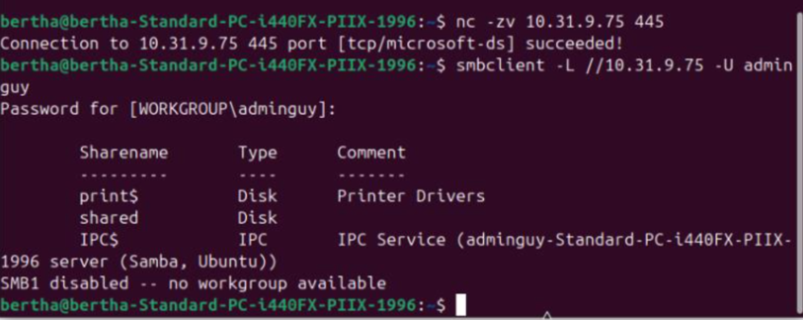

Next, we tested and validated the **Firewall rule: Block red-net -> fileserver** as pictured below (look at the last line and how it says connection timed out):

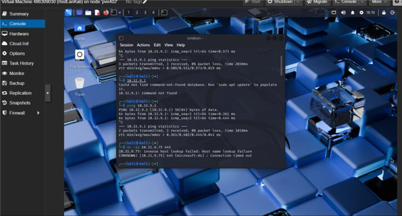

---

### Step 3: Deploy Workstation (Office Lady Bertha)

`WorkstationBertha` (`10.31.9.227`) was configured as the internal user workstation. Static IP was assigned using the same Netplan method as the web server. We verified basic connectivity by pinging the file server and gateway:

```bash
ping 10.31.9.75    
ping 10.31.9.1     
```

To validate that the Samba share was accessible from Bertha:

```bash
sudo apt install cifs-utils -y
sudo mount -t cifs //10.31.9.75/shared /mnt -o username=bertha

ls /mnt
```
This confirmed testfile.txt is visible in the shared directory as pictured below (first from Bertha POV and then from Admin guy POV):

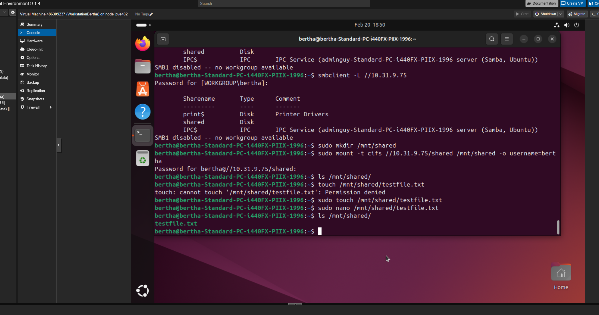

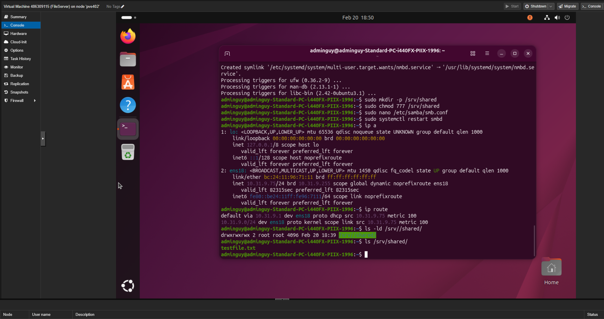

**Realistic User Simulation:** To simulate normal workstation behavior, Bertha performed the following user-level actions:

```bash
# Write a file to the shared drive
echo "Project notes from Bertha - $(date)" > /mnt/bertha-notes.txt

# Read it back
cat /mnt/bertha-notes.txt

# Browse the internal web server 
curl http://10.31.9.135

```

This confirmed Bertha could both read from and write to the shared file server and reach the web server.

---

### Suricata Alert from Nmap Scan

This is how we demonstrated Suricata is actively alerting by triggering a detection from the Red LAN (specically an NMap scan).

**Kali Red Network Validation:** Before running any offensive tooling, we confirmed Kali was properly deployed and functional on the Red LAN:

```bash
ip a

ping -c 4 10.32.9.1

ping -c 4 10.31.9.1

```

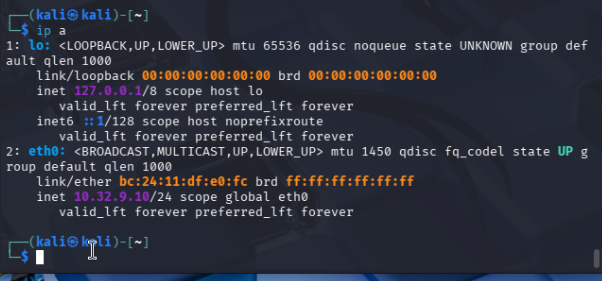

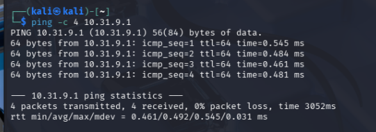

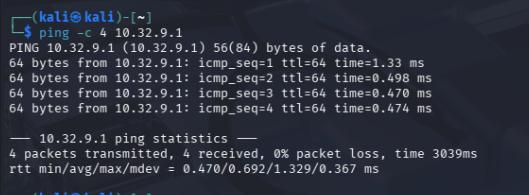

With Kali confirmed functional and isolated correctly on the Red network, we proceeded with the scan:

From the Kali attacker box (`10.32.9.1`), we ran an aggressive scan against the web server:

```bash
sudo nmap -sS -sV -O -Pn 10.31.9.1
```

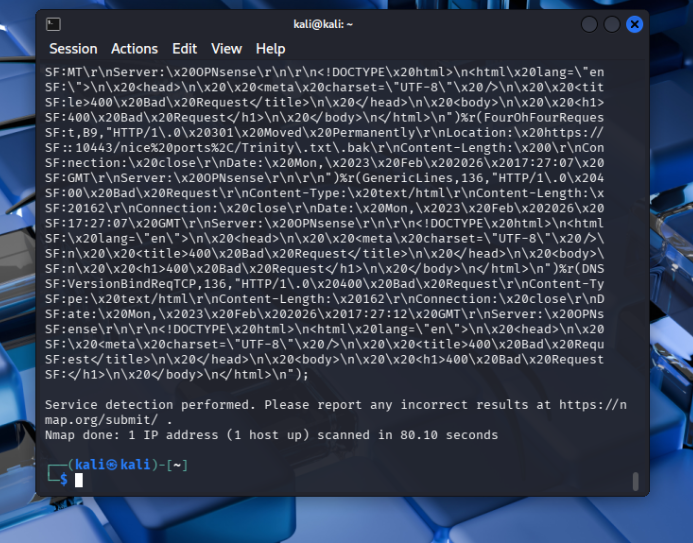

**Validation:** Navigated to **Services -> Intrusion Detection -> Alerts** in OPNsense and confirmed the alert fired:

| SID | Rule Name | Source IP | Action |
| --- | --- | --- | --- |
| **2024364** | ET SCAN Potential VNC Scan | 10.32.9.10 | Alert |

Suricata alert confirmed and IDS is operational and detecting Red LAN scanning activity (see picture below).

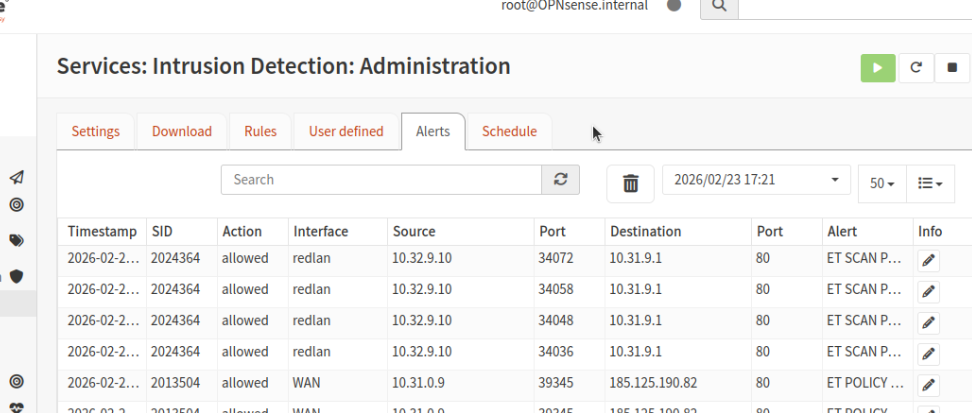

---

## Appendix A: Ubuntu Package Repository Fix

Because Ubuntu 24.10 "Oracular" is a non-LTS release, the standard repositories had moved to the legacy archives. We ran the following on all Blue LAN servers before installing any packages:

```bash
sudo nano /etc/apt/sources.list.d/ubuntu.sources
# Change 'us.archive.ubuntu.com' and 'security.ubuntu.com'
# to 'old-releases.ubuntu.com'
sudo apt update
```

---

## Appendix B: Infrastructure Debugging Notes

### Boot Loop Fix

**Issue:** VMs were booting into the OS installer repeatedly instead of the installed OS.

**Resolution:** We manually updated the Proxmox hardware settings:

1. **Hardware Tab:** Selected the CD/DVD drive and chose "Do not use any media."
2. **Options Tab:** Updated the **Boot Order** to ensure the `scsi0` hard disk was the first priority.

### Migration & DHCP Fix

**Migration:** Initially, VMs were split between nodes `pve202` and `pve404`. We migrated all VMs to `pve402` to ensure they shared the same virtual bridges (`ba09000` and `ra09000`).

**Dnsmasq (DHCP) Fix:** Kali initially received no IP because the DHCP service wasn't listening on the Red interface.

- **Navigation:** *Services -> Dnsmasq DNS & DHCP -> General.*
- **Fix:** Enabled the `redlan` checkbox in the **Interfaces** list and restarted the service.


### Interface Expansion Fix (OPNsense CLI)

**Issue:** The OPNsense router originally only recognized the WAN and LAN (Blue) interfaces. The Red LAN was physically connected but not logically assigned.

**Resolution:** We accessed the OPNsense Console/CLI. Using **Option 1 (Assign Interfaces)**, we identified the third virtual NIC (`vtnet2`) and assigned it to the system. This allowed the interface to appear in the Web GUI for final configuration (aka WAN, LAN and the new addition of redlan).


### Suricata Timestamp Synchronization Fix

**Issue:** Suricata alerts were firing, but timestamps were offset from local testing time, making log correlation difficult.

**Resolution:** The system was defaulting to UTC. We navigated to **System → Settings → General** and updated the Timezone to `America/Chicago`. This synced the IDS logs with live attack simulations.


---

## Appendix C: Sources & Peers
- Worked on project with Mahin and Rabie
- ProxMox Adding another ethernet to Your Server! https://youtu.be/sZ2f3sw8HCw?si=WImYh4eppyu5_RvU
- Ultimate Beginner's Guide to OPNsense https://youtu.be/vJBoCgptF-0?si=eWHC69PKKmRx2i0D
- OPNsense ProxMox setup https://youtu.be/Oad4am_NOn0?si=BRUBD_BPDvPj0YDy
- Virtualziing OPNsense on Proxmox made EASY https://youtu.be/lg1bw1S5zCg?si=pb5QGGxJbYdNQoGH
- How to port forward on OPNsense firewall https://youtu.be/i546YF91dHk?si=8SUoguoIXk7HHmxD
- User ProxMox as a VPN server https://youtu.be/SRa76aFFK3Y?si=0xtSTiszm6-JShFv
- From Zero to Proxmox: A Easy To Follow Getting Started Guide https://www.youtube.com/watch?v=5j0Zb6x_hOk
- Proxmox beginner's guide: everything you need to get started https://www.youtube.com/watch?v=lFzWDJcRsqo
- DVWA setup https://github.com/digininja/DVWA
- Utilized draw.io extension in VS code to create network diagram
- Utilized Gemini for assitance with debugging as allowed per syllabus Code of Conduct


