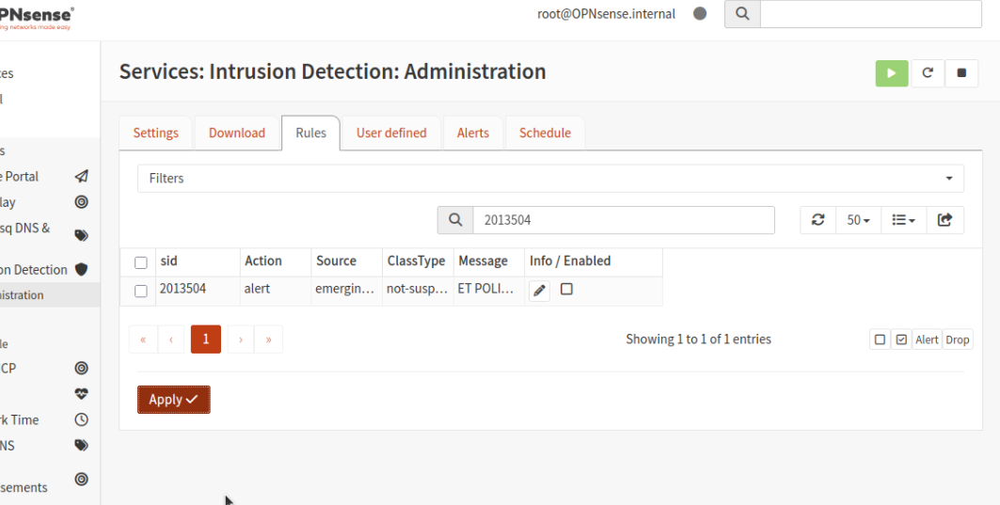

# Suricata IDS Tuning & Documentation - Team 09

We suppressed **SID 2013504** (ET POLICY GNU/Linux APT User-Agent Outbound).

**Reasoning:** This rule was flagging standard Ubuntu package updates hitting `security.ubuntu.com` as suspicious outbound activity. Since this is expected and benign behavior on our Blue LAN servers, suppressing it reduced alert noise so we could focus on genuine threats originating from the Red LAN.

**Steps to suppress:**

1. In the Alerts log, located SID 2013504.
2. Clicked the suppress icon next to the alert entry.
3. Confirmed the suppression appeared under **Services -> Intrusion Detection -> Suppressions**.

